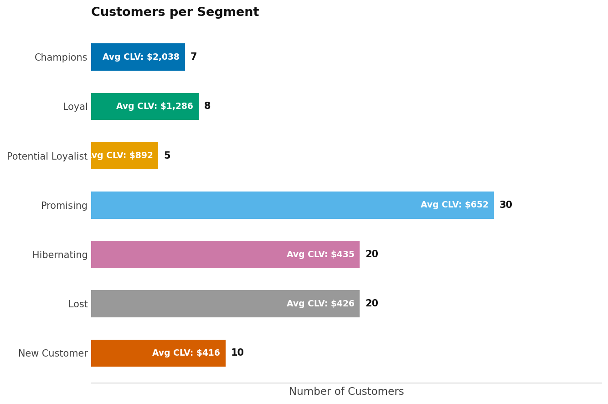
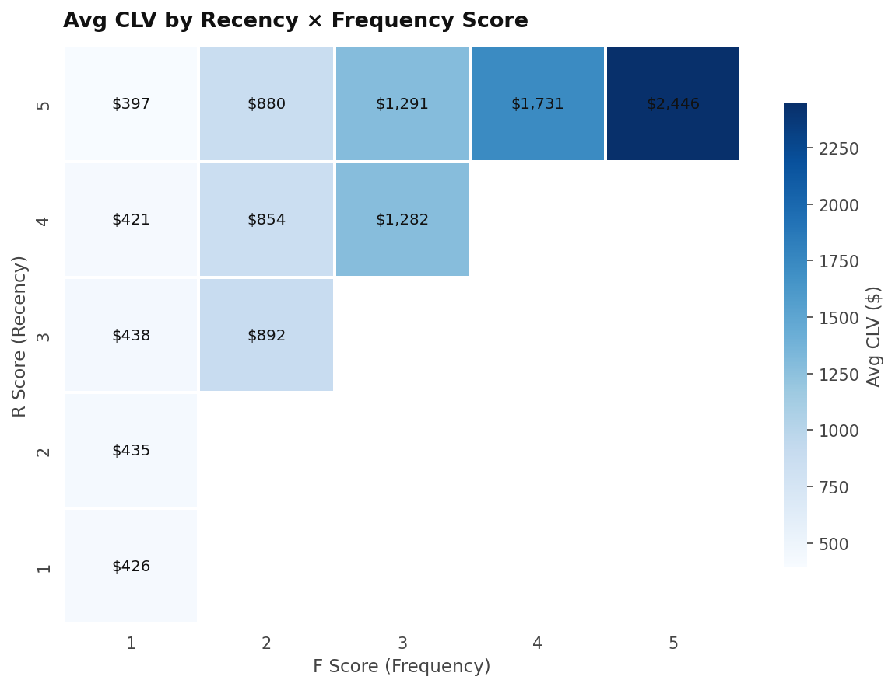
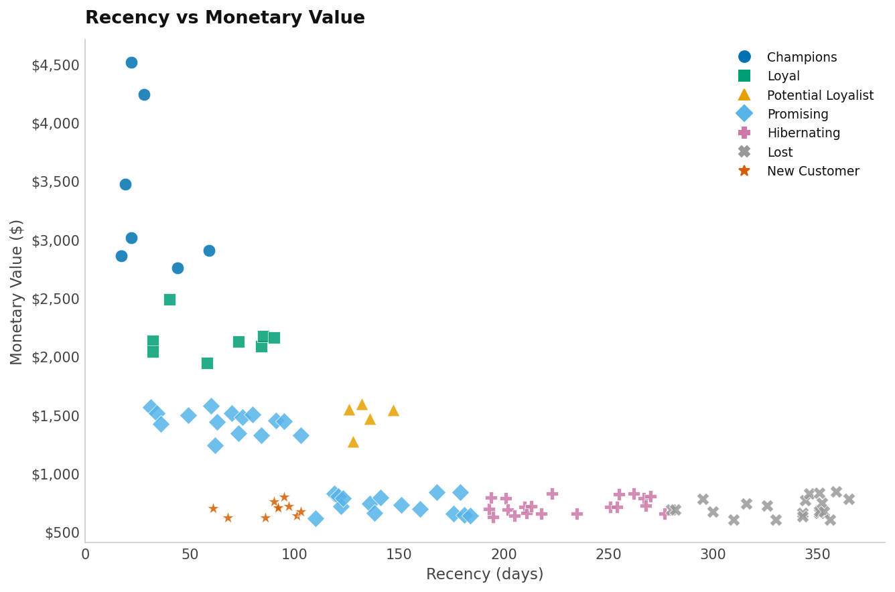
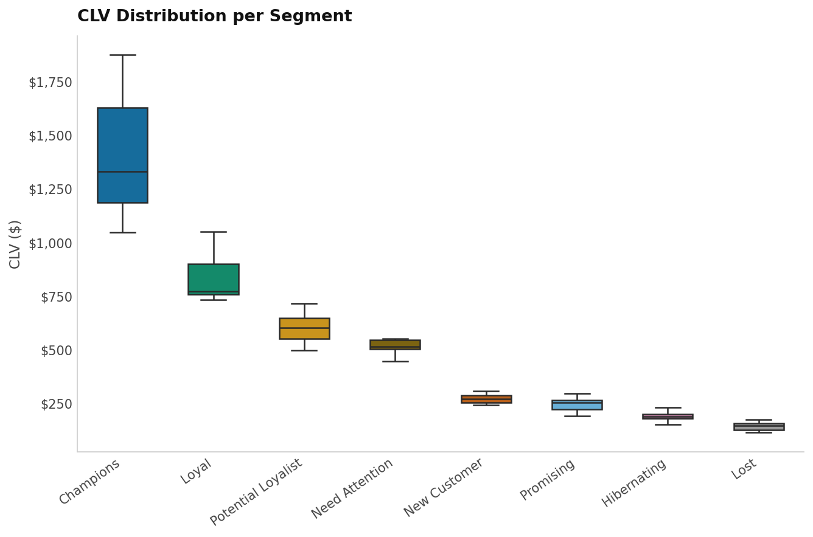

# RFM Customer Analysis

A lightweight, dependency-minimal Python pipeline that scores customers using **Recency, Frequency, and Monetary (RFM)** analysis, segments them into 11 behavioural groups, estimates **Customer Lifetime Value (CLV)**, and produces a set of publication-quality charts.

---

## What It Does

1. **Scores** each customer 1–5 across R, F, and M dimensions
2. **Segments** customers into 11 groups (Champions, Loyal, At Risk, Lost, etc.)
3. **Estimates CLV** using a configurable lifespan and margin
4. **Visualises** the results across four charts

---

## Project Structure

```
.
├── rfm_mockup.csv                  # Sample input data
├── rfm_analysis.py                 # Core scoring, segmentation & CLV engine
├── rfm_analysis.csv                # Output: enriched customer data
├── rfm_dashboard.py                # Chart generation
├── rfm_chart_1_segments.png        # Customers per segment
├── rfm_chart_2_heatmap.png         # Avg CLV by R × F score
├── rfm_chart_3_scatter.png         # Recency vs Monetary Value
├── rfm_chart_4_clv_distribution.png# CLV distribution per segment
└── rfm_dashboard.png               # Combined dashboard
```

---

## Quickstart

### 1. Install dependencies

The analysis script uses only the Python standard library. The dashboard requires:

```bash
pip install matplotlib seaborn pandas numpy
```

### 2. Prepare your data

Your input CSV must have these columns:

| Column | Type | Description |
|---|---|---|
| `customerid` | string | Unique customer identifier |
| `recency` | int | Days since last purchase |
| `frequency` | int | Number of purchases |
| `monetaryValue` | float | Total spend |

### 3. Run the analysis

```bash
python rfm_analysis.py
```

Outputs `rfm_analysis.csv` with scores, segments, and CLV for each customer.

### 4. Generate charts

```bash
python rfm_dashboard.py
```

Saves four PNG charts to the working directory.

---

## Segmentation Logic

Segments are assigned from the R and F scores by an **ordered chain — the first
matching rule wins.** The order is load-bearing. Several rules overlap, and earlier
ones deliberately shadow later ones: `At Risk` is tested before `Loyal` so that a
frequent buyer who has gone quiet is flagged as lapsing rather than filed as loyal.

This means **no rule below can be read on its own.** Each one means "this condition,
*and* none of the conditions above it".

| # | Segment | Fires when (given no earlier rule matched) |
|---|---|---|
| 1 | Champions | R ≥ 4 and F ≥ 4 |
| 2 | Can't Lose Them | R = 1 and F ≥ 4 |
| 3 | At Risk | R ≤ 2 and F ≥ 3 |
| 4 | Loyal | R ≥ 2 and F ≥ 3 |
| 5 | New Customer | R ≥ 4 and F = 1 |
| 6 | Need Attention | R = 3 and F = 2 |
| 7 | Potential Loyalist | R ≥ 3 and F = 2 |
| 8 | Promising | R ≥ 3 and F = 1 |
| 9 | About to Sleep | R = 2 and F = 2 |
| 10 | Hibernating | R = 2 and F = 1 |
| 11 | Lost | R = 1 and F ≤ 2 |

Any (R, F) pair outside 1–5 raises `ValueError` rather than falling through to a
default label.

### The actual result grid

Because the rules overlap, the table above is a description of the mechanism, not a
specification. **This grid is the specification** — it is what the code actually
assigns for every possible pair, and `rfm_audit.py` checks the code against it on
every run:

|  | F=1 | F=2 | F=3 | F=4 | F=5 |
|---|---|---|---|---|---|
| **R=5** | New Customer | Potential Loyalist | Loyal | Champions | Champions |
| **R=4** | New Customer | Potential Loyalist | Loyal | Champions | Champions |
| **R=3** | Promising | Need Attention | Loyal | Loyal | Loyal |
| **R=2** | Hibernating | About to Sleep | At Risk | At Risk | At Risk |
| **R=1** | Lost | Lost | At Risk | Can't Lose Them | Can't Lose Them |

Reading the grid rather than the rules avoids the trap: `R=2, F=3` satisfies both the
`Loyal` and `At Risk` conditions as written, and only the ordering decides it is
`At Risk`.

---

## CLV Formula

```
CLV = observed annual profit  ×  P(still active)  ×  discounted horizon
```

### Why not the textbook formula

The obvious formulation is `avg_order_value × frequency × lifespan × margin`. It does
not work, and the reason is worth stating because it is easy to reintroduce:
`avg_order_value` is `monetaryValue / frequency`, so the frequency terms cancel and
the whole expression collapses to `monetaryValue × lifespan × margin` — a constant
rescaling of the M column. It carries no information that M did not already carry,
and it scores a customer who spent $1,000 across ten orders identically to one who
spent $1,000 once and never returned.

Any formula shaped like `AOV × frequency × k` collapses the same way, because
`AOV × frequency` *is* total spend. For CLV to say something new it has to answer a
question the spend total cannot: **will they keep buying?**

### How it works now

| Term | Meaning |
|---|---|
| `annual_profit` | `monetaryValue / observation_years × MARGIN` — the observed rate of profit |
| `p_active` | `exp(-LAPSE_DECAY × recency / expected_gap)` — chance they are still buying |
| `horizon` | `Σ 1/(1+DISCOUNT_RATE)^y` over the lifespan — future margin, discounted |

`expected_gap` is the customer's own purchase cycle, `OBSERVATION_DAYS / frequency`.
Frequency enters CLV through this term rather than through the spend term, which is
what stops it cancelling. Silence is then judged **relative to each customer's own
cadence**: a customer who buys every 61 days and has been quiet for 90 is 1.5 cycles
overdue and genuinely at risk, while one who buys twice a year and has been quiet for
90 days is behaving perfectly normally. The old formula scored both identically.

A purchase cycle needs at least two purchases to observe. Single-purchase customers —
65 of the 100 in the sample — have no observed cadence, so they borrow the median
cycle of customers who did repeat. Treating the whole window as one long gap instead
would make a one-time buyer look punctual until day 364.

### Configuration

Editable at the top of `rfm_analysis.py`:

| Parameter | Default | Notes |
|---|---|---|
| `LIFESPAN_YEARS` | 3 | Projection horizon |
| `MARGIN` | 0.20 | Profit margin on revenue |
| `OBSERVATION_DAYS` | 365 | **An assumption, not derived from the data.** Set it to your real extract window |
| `DISCOUNT_RATE` | 0.10 | Annual discount applied to future margin |
| `LAPSE_DECAY` | 0.5 | How fast `p_active` falls once a customer is overdue |

`OBSERVATION_DAYS` is the one to check first. Recency, frequency and spend say nothing
about how long the extract covered, so it cannot be inferred — it is stated. The sample
data has a maximum recency of exactly 365, which is what a one-year window looks like.

### Output columns

`rfm_analysis.csv` gains `aov`, `expected_gap` and `p_active` alongside `clv`, so the
estimate can be read rather than taken on trust.

---

## Charts

### Customers per Segment
Horizontal bar ordered by avg CLV, with customer count and inline avg CLV labels.



### Avg CLV Heatmap
Average CLV across the R-score × F-score grid.



### Recency vs Monetary Value
Scatter plot coloured and shaped by segment.



### CLV Distribution per Segment
Box plot showing CLV spread within each segment.



---

## Semantic Layer (TypeSafe / Jev)

RFM is a behavioural model: it reads what a customer *did*. These four scripts add a
semantic layer on top using [TypeSafe](https://docs.typesafe.ai)'s Jev model, which
returns typed judgments and probabilities rather than text.

The division of labour is deliberate and holds throughout: **Jev judges meaning, code
owns every number.** Scoring, thresholds, filters, weights and arithmetic stay in
Python. Nothing that RFM already computes is ever asked of the model.

### Setup

```bash
pip install typesafe-sdk
export TYPESAFE_API_KEY=sk-...   # from https://console.typesafe.ai/
```

Every script also accepts `--offline`, which substitutes clearly-labelled synthetic
answers so the deterministic half of the pipeline can be exercised without a key.
Offline results are cached separately and can never be served to a live run.

### `rfm_query.py` — ask the customer base questions in English

```bash
python rfm_query.py "which lapsed customers are complaining about service?"
```

One request carries the whole query shape — action, segment, recency band, value
band, sort, direction, limit — and irrelevant answers are discarded. The model
decides you meant "lapsed and valuable"; `RECENCY_BANDS` in code decides that lapsed
means 31–90 days.

### `rfm_signals.py` — the signal RFM cannot see

Asks five independent judgments about each customer's most recent verbatim (churn
intent, severity, driver, recoverability, whether it needs a human), then combines
them with the RFM scores using `WEIGHTS`.

Raw judgments land in `rfm_signals.csv`; scoring is a separate step, so re-weighting
costs nothing:

```bash
python rfm_signals.py            # ask, then score
python rfm_signals.py --rescore  # re-weight existing judgments, no API calls
```

The headline output is the **blind-spot report**: customers who look healthy on
behaviour while telling us they are leaving. A Champion scores 5/5/5 right up until
the day they go, which is precisely the failure mode a behavioural model cannot fix
from within.

Requires `rfm_verbatims.csv` from `make_verbatims.py`.

### `rfm_plays.py` — recommendations that recompute

Slide 8 of the deck previously hardcoded four recommendations written for this
dataset. This chooses a play per segment from a library defined in `PLAYS`, scores
urgency and reversibility, and writes `rfm_plays.json`. Picks below
`CONFIDENCE_FLOOR` are marked **ANALYST REVIEW** on the slide rather than asserted.

`build_pptx.py` reads that file when present and falls back to the built-in
recommendations when it is absent, so the deck always builds.

### `jev_dashboard.py` — visualising what the model did

```bash
python jev_dashboard.py
```

Four charts, each answering one question:

| Chart | Question |
|---|---|
| `jev_chart_1_blindspots.png` | Who did the language flag that the numbers did not? |
| `jev_chart_2_intent_vs_severity.png` | Is "angry" the same as "leaving"? |
| `jev_chart_3_drivers.png` | What is driving dissatisfaction? |
| `jev_chart_4_confidence.png` | How sure was the model about each recommendation? |

The second is the one worth looking at twice. An unresolved failure scores near the
top on severity and near the bottom on intent to leave — those customers are
complaining *to* you, not walking away. Collapsing the two into a single "risk"
number hides both, which is exactly the bug this chart caught.

Palette is a three-colour Okabe-Ito subset, validated for colour-vision deficiency
and contrast. Every series is direct-labelled as well as coloured.

### `rfm_audit.py` — does the code match the docs?

```bash
python rfm_audit.py --rules-only   # deterministic, no API, no cost
```

Pass 1 lifts the real `segment()` out of `rfm_analysis.py` with `ast`, runs all 25
R x F combinations through it, and compares the result against the criteria table in
this README. Pass 2 asks Jev which segment description best fits each customer and
flags disagreements for review.

Pass 1 is the one that finds bugs, and it needs no model. A rule-ordering defect
should be fixed in code, never papered over with a probability.

### Pipeline order

```bash
python rfm_analysis.py     # scores, segments, CLV
python make_verbatims.py   # synthetic customer text
python rfm_signals.py      # churn signals + composite priority
python rfm_plays.py        # per-segment play selection
python jev_dashboard.py    # charts showing how the model scored
python build_pptx.py       # deck, now reading the selected plays
python rfm_audit.py        # verification
```

### What the deck gains

With `rfm_priority.csv` present, `build_pptx.py` builds 12 slides instead of 10:

- **Slide 8 — What the Numbers Could Not See.** The customers flagged by their own
  words while scoring healthy on every purchase measure, and the lifetime value
  attached to them.
- **Slide 9 — Strategic Recommendations.** Now driven by `rfm_plays.json`, with
  low-confidence picks marked for analyst review rather than asserted.
- **Slide 12 — How This Was Built.** Plain-English explanation of the five questions
  asked, why a trained classifier was the wrong tool here, and what deliberately
  stayed ordinary arithmetic.

Both new slides carry a footnote stating that the customer messages are illustrative
sample text. Remove `rfm_priority.csv` and the deck reverts to its original 10 slides.

---

## License

MIT
