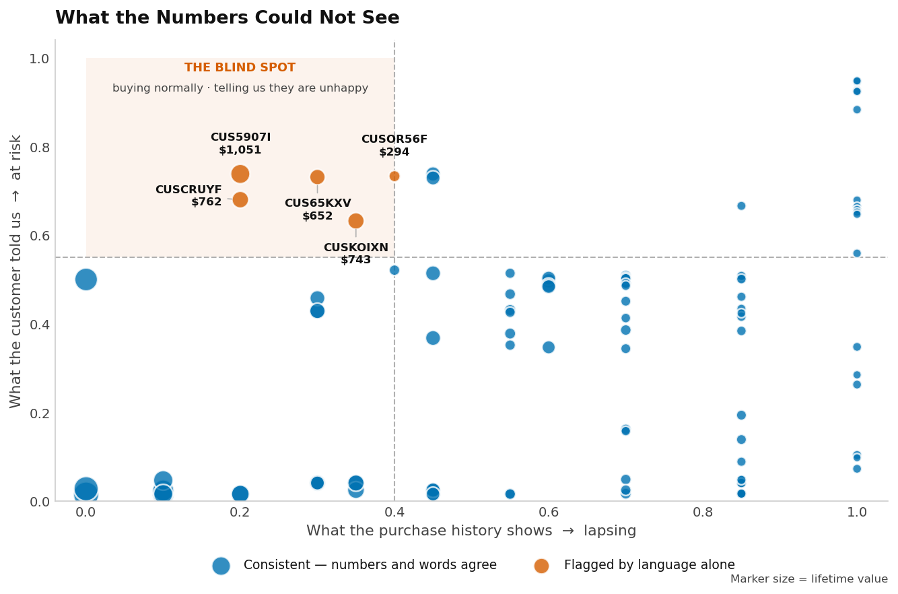
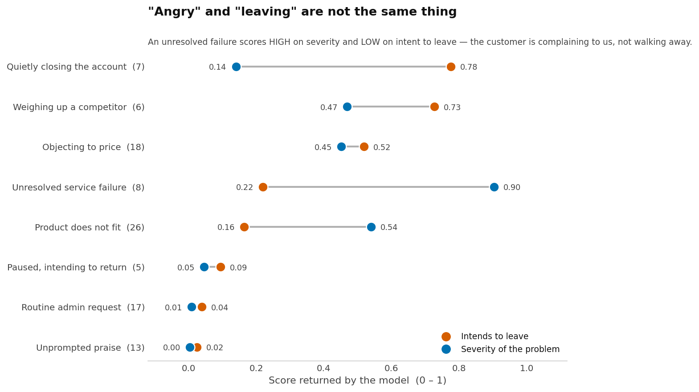

# RFM Customer Analysis

A customer segmentation pipeline that scores 100 customers on Recency, Frequency and
Monetary value, estimates lifetime value, and then does something a conventional RFM
model cannot: it reads what those customers actually *wrote*, and combines that with
what they did.

The project is built around one design decision, applied consistently:

> **Code owns every number. The model owns meaning.**

Nothing that can be calculated is ever asked of a language model, and nothing that
requires reading a sentence is ever attempted with arithmetic. The rest of this
document explains where that line sits, why it sits there, and what it produced.

---

## The problem this solves

RFM is a behavioural model. It scores a customer on three things they *did* — how
recently they bought, how often, and how much they spent — and sorts them into
segments from Champions through to Lost. It is well-established, cheap to compute,
and genuinely useful.

It also has a structural blind spot, and the word *structural* is doing real work
there. Because RFM is built entirely from purchase history, it cannot see a customer
who has **decided to leave but has not yet stopped buying.**

That customer scores 5 out of 5 on every dimension. They look identical to your best
account, right up until the day they are gone. No amount of tuning the RFM model
fixes this, because the evidence simply is not in the data RFM reads.

The evidence is in what they wrote to you: the support ticket, the survey response,
the email to their account manager. That is the gap this project closes.

---

## The division of labour

| | **Python** | **Jev** (TypeSafe) |
|---|---|---|
| **Owns** | Arithmetic, thresholds, weights, control flow, ranking, I/O | Reading language and returning a typed judgment |
| **Example** | R/F/M scores, CLV, segment assignment, filters, composite scoring | "Is this customer signalling they want to leave?" |
| **Fails how?** | Loudly and deterministically, in a way you can test | Probabilistically, with a confidence figure attached |
| **A change costs** | A re-run | An API call |

The line is drawn on a simple test: **could a competent analyst compute this with a
spreadsheet and a clear definition?** If yes, it belongs in Python, because code is
auditable, reproducible and free. If it requires understanding what a sentence means,
it belongs to the model, because no threshold will ever get there.

This matters more than it sounds. The temptation with a capable model is to hand it
the whole problem — give it the customer record and ask "how at-risk is this
account?" That produces a number nobody can check, defend or reproduce. Splitting the
work means every figure in the final deck traces back to either an explicit formula
or a specific, inspectable judgment about a specific sentence.

---

## Part 1 — What the code owns

### Scoring

Each customer is scored 1–5 on Recency, Frequency and Monetary value. Recency and
Monetary are percentile-ranked across the base; Frequency is a direct ladder — one
purchase scores 1, five or more scores 5.

### Segmentation

Segments are assigned by an **ordered chain, where the first matching rule wins.**
The order is load-bearing: `At Risk` is tested before `Loyal`, so a frequent buyer who
has gone quiet is flagged as lapsing rather than filed as loyal.

This was originally documented as a flat table of rules, which is where a real defect
hid. The rules overlap — `R=2, F=3` satisfies both the `Loyal` and `At Risk`
conditions as written — so **13 of the 25 possible score combinations matched more
than one documented rule.** A table like that cannot be read as a specification.

The authoritative statement is therefore the result grid, not the rule list:

|  | F=1 | F=2 | F=3 | F=4 | F=5 |
|---|---|---|---|---|---|
| **R=5** | New Customer | Potential Loyalist | Loyal | Champions | Champions |
| **R=4** | New Customer | Potential Loyalist | Loyal | Champions | Champions |
| **R=3** | Promising | Need Attention | Loyal | Loyal | Loyal |
| **R=2** | Hibernating | About to Sleep | At Risk | At Risk | At Risk |
| **R=1** | Lost | Lost | At Risk | Can't Lose Them | Can't Lose Them |

`rfm_audit.py` regenerates this grid from the live code on every run and diffs it
against the table above. Reorder the chain and the audit fails.

### Customer lifetime value

The textbook formula is `average order value × frequency × lifespan × margin`. It does
not work, and the reason is worth stating because it is easy to reintroduce:

```
average_order_value = monetaryValue / frequency

CLV = (monetaryValue / frequency) × frequency × lifespan × margin
    =  monetaryValue × lifespan × margin
```

The frequency terms cancel. The formula collapses to a **constant rescaling of the
Monetary column** — it carries no information that column did not already carry, and
it scores a customer who spent $1,000 across ten orders identically to one who spent
$1,000 once and never returned.

Any formula shaped like `AOV × frequency × k` collapses the same way, because
`AOV × frequency` *is* total spend. For CLV to say something new, it has to answer a
question the spend total cannot: **will they keep buying?**

```
CLV = observed annual profit  ×  P(still active)  ×  discounted horizon
```

`P(still active)` decays with how overdue a customer is *relative to their own
purchase cycle*. Frequency enters here rather than in the spend term, which is what
stops it cancelling — and it means silence is judged in context. A customer who buys
every 61 days and has been quiet for 90 is 1.5 cycles overdue and genuinely at risk;
one who buys twice a year and has been quiet for 90 days is behaving perfectly
normally. The old formula scored both identically.

Correlation with the Monetary column fell from exactly 1.0 to 0.985, and the
CLV-to-spend ratio now spans 0.18–0.46 rather than a flat 0.60.

Single-purchase customers — 65 of the 100 here — have no observed cadence at all, so
they borrow the median cycle of customers who did repeat. Treating the whole
observation window as one long gap would make a one-time buyer look punctual right up
to day 364.

Defaults are a 3-year horizon, a 20% margin, a 10% annual discount rate and a 365-day
observation window, all editable at the top of `rfm_analysis.py`. The observation
window is the one to check first — see [Limitations](#limitations).

---

## Part 2 — What the model owns

Every customer has one recent message attached. For each, Jev answers five questions,
batched into a single request because they are independent given the same text:

| Question | Returns |
|---|---|
| Are they signalling they want to leave? | Probability, 0–1 |
| How serious is the problem they describe? | Position on a 4-level scale |
| What is driving it? | One of: service, price, product, competitor, circumstance, none |
| Could we still keep them if we acted now? | Probability, 0–1 |
| Does this need a person, or a campaign? | Probability, 0–1 |

These come back as **numbers, not prose** — values ordinary code can threshold, weight
and rank without parsing anything.

### Why not a trained classifier

A supervised model learns from examples. It needs thousands of past messages, each
labelled by hand by someone who already knew the answer. This dataset has 100
customers and no labels at all, so there is nothing to train on.

Beyond that cold start, three differences mattered here:

- **Adding a question.** With a classifier, a new question means a new labelled
  dataset and another training run. Here it is a few lines and a few minutes.
- **Fixing a mistake.** The composite scoring rule in this project turned out to be
  wrong (see below). Correcting it cost **zero API calls**, because the raw judgments
  were already on disk. With a trained model, the equivalent fix is a retrain.
- **Knowing when it is unsure.** Each answer carries a confidence figure, which the
  pipeline acts on rather than discards.

This is not an argument that the approach beats supervised learning generally. At high
volume where per-call cost dominates, or on a narrow stable task with abundant labels,
a trained classifier is the better tool. **This is the step before machine learning,
not a replacement for it** — pair enough of these judgments with real retention
outcomes and they become features for a conventional model.

---

## Part 3 — Where the two halves meet

### Raw judgments and policy are stored separately

Inference writes reusable raw judgments to `rfm_signals.csv`. Scoring is a separate
step that applies weights defined in code. Changing a weight is not a new question, so
re-scoring the entire base costs nothing:

```bash
python rfm_signals.py --rescore
```

That separation is what made the fix below free rather than expensive.

### The composite

Behavioural risk (what RFM sees) and stated risk (what the customer said) are combined
with weights that live in Python and can be tuned without re-running inference. Value,
behavioural risk and stated risk currently weight 0.30 / 0.25 / 0.45.

### Confidence is acted on, not ignored

Where the model is unsure, the pipeline says so rather than presenting a guess.
Recommendations below a confidence floor are marked **ANALYST REVIEW** on the slide
instead of being asserted — 2 of 8 segments, in the current run.

---

## What it found

**Five customers scoring healthy on every purchase measure while telling us they were
unhappy** — $3,502 of lifetime value, **8.5% of the portfolio.** Four of the five had
an unresolved service complaint. RFM ranked every one of them as safe; it had no way
not to.



### "Angry" and "leaving" are not the same signal

The most useful finding was not a customer, but a distinction:

| Message type | Intent to leave | Severity |
|---|---|---|
| "Please close my account" | **0.78** | 0.42 / 3 |
| "Fourth time I've chased this" | **0.22** | **2.71 / 3** |

A furious customer complaining **to** you has not left — they are giving you a chance.
Someone calmly closing their account has already gone. Different problems, different
responses.



### The model exposed a bug in the scoring

The first composite blended intent and severity 60/40. Because Jev correctly reads an
unresolved failure as *low* intent to leave, that blend filed a top-tier customer
sitting on a maximum-severity unresolved failure as **safe** — precisely the customer
who leaves without warning.

A weighted average is for preferences that genuinely trade off against each other.
"Either of these is bad on its own" needs `max`, not a blend. Correcting it took zero
API calls and moved the blind-spot count from 1 to 5.

---

## Engineering practices

The parts that are not analysis, but determine whether the analysis can be trusted:

- **The audit is deterministic and free.** `rfm_audit.py --rules-only` verifies the
  code against its own documentation with no model involved. A defect in rule ordering
  is a code bug and gets fixed in code — never papered over with a probability.
- **Offline mode is isolated.** Every script runs with `--offline` using synthetic stub
  answers, so the deterministic half stays testable without an API key. Stub results
  are cached in a **separate directory** from live ones; sharing a cache would let an
  offline run poison a later real one, since the cache key covers the model, state and
  questions — none of which change when a key appears.
- **Inference is cached by content.** Re-running the pipeline costs nothing unless a
  question or the underlying text actually changed.
- **Build-time guards.** The deck builder raises rather than silently producing a
  broken slide — for example, on a title too long to fit its line.
- **The deck meets WCAG AA.** Verified programmatically across all 14 slides: 4.5:1
  contrast for body text, real alt text on every chart, and no meaning carried by
  colour alone.

---

## Running it

Requires Python 3, plus `matplotlib`, `seaborn`, `pandas`, `python-pptx` and
`typesafe-sdk`. The core analysis engine uses only the standard library.

```bash
export TYPESAFE_API_KEY=sk-...   # from https://console.typesafe.ai/
```

```bash
python rfm_analysis.py     # scores, segments, CLV
python make_verbatims.py   # sample customer messages
python rfm_signals.py      # language signals + composite priority
python rfm_plays.py        # recommended action per segment
python jev_dashboard.py    # charts showing how the model scored
python build_pptx.py       # 14-slide deck
python rfm_audit.py        # verification
```

Add `--offline` to any Jev-dependent step to run it without a key.

---

## Repository map

| File | Role | Owner |
|---|---|---|
| `rfm_analysis.py` | Scoring, segmentation, CLV | Python |
| `rfm_dashboard.py` | The four RFM charts | Python |
| `make_verbatims.py` | Generates the sample customer messages | Python |
| `jev.py` | Shared client, caching, offline stubs | Python |
| `rfm_signals.py` | Five judgments per customer, then composite scoring | Both |
| `rfm_plays.py` | Selects a play per segment from a code-owned library | Both |
| `rfm_query.py` | Plain-English questions against the customer base | Both |
| `rfm_audit.py` | Code-versus-documentation verification | Both |
| `jev_dashboard.py` | Charts of what the model did | Python |
| `build_pptx.py` | The 14-slide deck | Python |

---

## Limitations

Stated plainly, because they bound what the results mean:

- **The customer messages are synthetic.** The source dataset is numeric only, so the
  verbatims were generated to demonstrate the method. The pipeline is real; the text it
  reads is not. Roughly one customer in five was deliberately given a message that
  contradicts their RFM standing, which is what the blind-spot detection is tested
  against.
- **One dataset, 100 customers, 8 of 11 possible segments.** Nothing here is validated
  against real retention outcomes, and the thresholds — the confidence floor, the
  blind-spot cut-offs, the composite weights — are reasoned starting points, not tuned
  ones.
- **`OBSERVATION_DAYS` is an assumption, not a measurement.** Recency, frequency and
  spend say nothing about how long the extract covered, so it is stated in config
  rather than derived. Every CLV figure scales with it.
- **Typed output guarantees the interface, not the truth.** A judgment arriving as a
  clean number between 0 and 1 says nothing about whether it is correct. Any real
  deployment needs its performance measured on its own domain.

---

## License

MIT
